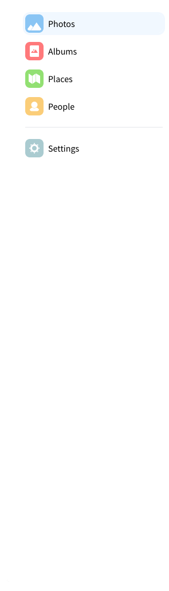

# Make-Your-Own-Google-Photos



So, imagine you're tired of Google Photos holding you back since you cannot upload all memories since its  behind a paywall. Plus, who knows where those photos really end up? It's like sending your prized possessions off to some sketchy storage unit run by a random guy 

So you build your own Google photos  , Just point the code  to your photo stash, and voila! It goes through your storage instantly And the best part? Your memories stay on your own hardware right where they belong, on your own trusted server, away from 's questionable storage unit .

You configure Photoview to look for photos and videos within a directory on your file system. The scanner automatically picks up your media and start to generate thumbnail images to make browsing super fast.

When your media has been scanned they show up on the website, organised in the same way as on the filesystem.

feel free to join the Discord server after i lear how to mange the inivite setting ( link will be updated soon)

## Main features

- **Closely tied to the file system**. The website presents the images found on the local filesystem of the server, directories are mapped to albums.
- **User management**. Each user is created along with a path on the local filesystem, photos within that path can be accessed by that user.
- **Sharing**. Albums, as well as individual media, can easily be shared with a public link, the link can optionally be password protected.
- **Made for photography**. Photoview is built with photographers in mind, and thus supports **RAW** file formats, and **EXIF** parsing.
- **Video support**. Many common video formats are supported. Videos will automatically be optimized for web.
- **Face recognition**. Faces will automatically be detected in photos, and photos of the same person will be grouped together.
- **Performant**. Thumbnails are automatically generated and photos first load when they are visible on the screen. In full screen, thumbnails are displayed until the high resolution image has been fully loaded.
- **Secure**. All media resources are protected with a cookie-token, all passwords are properly hashed, and the API uses a strict [CORS policy](https://developer.mozilla.org/en-US/docs/Web/HTTP/CORS).


## Supported platforms

- [Docker](https://hub.docker.com/r/viktorstrate/photoview/)
- [Arch Linux Aur](https://aur.archlinux.org/packages/photoview)
- [Unraid](https://forums.unraid.net/topic/103028-support-photoview-corneliousjd-repo/)
- EmbassyOS: [announcement](https://start9labs.medium.com/new-service-photoview-72ee681b2ff0), [repo](https://github.com/Start9Labs/embassyos-photoview-wrapper)
- [YunoHost](https://github.com/YunoHost-Apps/photoview_ynh)

## Why yet another self-hosted photo gallery
Here are some, just to mention a ew from where i took inspiration adn some help tbh , 
There exists a lot of open-source self-hosted photo galleries already. 
- [Photoview]https://github.com/photoview/photoview
- [Piwigo](https://github.com/Piwigo/Piwigo)
- [Photoprism](https://github.com/photoprism/photoprism)


Why another photo management solution, you ask?

Well, I'm passionate about photography, and I've meticulously organized my entire collection on my local file server. It's fantastic because I have full control over where and how my photos are stored, making it easy to move them around or create backups.

But here's the snag: navigating through RAW images on a file server, especially over a local network, is a real headache.

Plus, I've got a treasure trove of old family photos on that server, and I'd love for my family to access them easily. And sometimes, I just want to share certain photos with friends without them having to jump through hoops to create an account.

So, what's the solution I'm after?

A scan-based approach that can automatically sort through my photos.
Support for RAW and EXIF parsing to maintain all those important details.
Capability for multiple users with options to share albums and photos publicly.
And, of course, it needs to be user-friendly and lightning-fast.
While many photo galleries come close, none quite hit the mark on all fronts.

## Setup with Docker


1. check  that Docker and docker-compose are installed and operational on your server.

2. Create a new `docker-compose.yml` file on your local machine. You can find an example file at [docker-compose.example.yml](/docker-compose.example.yml). Copy the contents of this example file into your newly created `docker-compose.yml`.

3. Open the `docker-compose.yml` file and locate the comments marked with `Change This:`. Adjust the values as needed to match your server setup. If you're just testing locally, you may not need to modify anything.

4. Once you've made the necessary changes (if any), it's time to start the server. Execute the following command in your terminal:

```bash
$ docker-compose up -d
```

This command will initiate the server in detached mode, allowing it to run in the background.

### Initial Setup

Once everything is set up correctly, you should encounter an initial setup wizard upon accessing the website for the first time. 


Here's what you need to do:

1. Enter a new username and password when prompted.

2. For the photo path, specify the path within the Docker container where your photos are stored. This can be configured in the `docker-compose.yml` file under `api` -> `volumes`. By default, the location is set to `/photos`.

3. Upon completion of the initial setup, a new admin user will be created with access to the photos located at the specified path.

4. Keep in mind that the photos will need to be scanned before they appear in the gallery. You can initiate a manual scan by navigating to `Settings` and clicking on `Scan All`.

## Setting Up Development Environment

### Local Setup

1. Begin by installing a local MySQL server and create a new database.

2. Rename `/api/example.env` to `.env` and update the `MYSQL_URL` field accordingly.

3. Similarly, rename `/ui/example.env` to `.env`.

### Starting the API Server

Ensure that [GoLang](https://golang.org/) is installed on your system.

To compile the API, certain C libraries are required. Refer to [go-face requirements](https://github.com/Kagami/go-face#requirements) for detailed information. You can install these libraries using the following commands:

```sh
# Ubuntu
sudo add-apt-repository ppa:strukturag/libheif
sudo add-apt-repository ppa:strukturag/libde265
sudo apt-get update
sudo apt-get install libdlib-dev libblas-dev libatlas-base-dev liblapack-dev libjpeg-turbo8-dev libheif-dev

# Debian
sudo apt-get install libdlib-dev libblas-dev libatlas-base-dev liblapack-dev libjpeg62-turbo-dev libheif-dev

# macOS
brew install dlib libheif
```

Then, execute the following commands:

```bash
cd ./api
go install
go run server.go
```

### Starting the UI Server

Ensure that [Node.js](https://nodejs.org/en/) is installed on your system.

In a new terminal window, navigate to the `ui` directory and run the following commands:

```bash
cd ./ui
npm install
npm start
```

You can now access the site at [localhost:1234](http://localhost:1234), and the GraphQL playground at [localhost:4001](http://localhost:4001).
